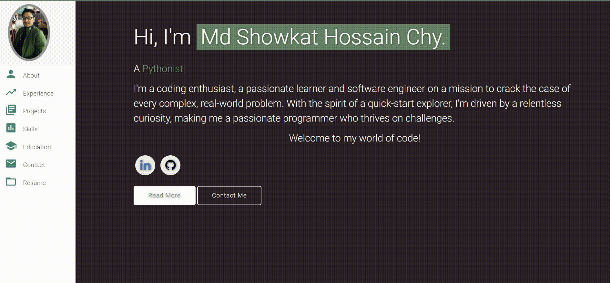

# Personal Portfolio ⚡️ 
*A digital canvas for software artistry.*

Welcome to my personal portfolio—a pristine playground where I paint my journey as a Software Developer. Explore the artistry at [https://showkat2203.github.io](https://showkat2203.github.io).

 

## A Glimpse 🖼️

 
  <kbd>
    
  </kbd>

:star: Show your appreciation—star this repository on GitHub!

## Features 📋
- ⚡️ Fully Responsive
- ⚡️ Valid HTML5 & CSS3
- ⚡️ Spellbinding Typing Animation with `Typed.js`
- ⚡️ Easily Customizable

## Setting Up & Launch 🚀
- Clone this repository and mold the content of <b>index.html</b> to your liking.
- Customize the images in the `chy.github.io/assets/img/` directory.
- For seamless deployment, embrace the magic of [Github Pages](https://create-react-app.dev/docs/deployment/#github-pages).
- Deploy your creation by naming the GitHub repository `<your-github-username>.github.io`.
- Push your masterpiece to the `master` branch of this repository.
- **P.S.:** Don't forget to infuse your Google Analytics `analyticsId` for personalization if you choose to utilize your own Google Analytics account.

## The Chapters 📚
- About me
- Experience
- Projects 
- Skills 
- Education
- Contact Info
- Resume

For a live tour, journey here: **[click me](https://showkat2203.github.io/)**

## Tools of the Trade 🛠️
- [**GitHub Pages**](https://create-react-app.dev/docs/deployment/#github-pages) - A magical realm for hosting static websites (HTML, CSS, JS).
- [**Materialize**](https://materializecss.com/) - The spellbook for Google's Material Design elements.
- [**Typed.js**](https://mattboldt.com/demos/typed-js/) - The wand for enchanting typing animations.

## Contributions 💡
#### Step 1

- **Option 1**
    - 🍴 Fork this realm!

- **Option 2**
    - 👯 Clone this realm to your sacred machine.

#### Step 2

- **Craft your magic** 🔨🔨🔨

#### Step 3

- 🔃 Unleash a new spell in the form of a pull request.

## License 📄
This masterpiece is licensed under the MIT License - discover the [LICENSE.md](./LICENSE) incantation for details.
